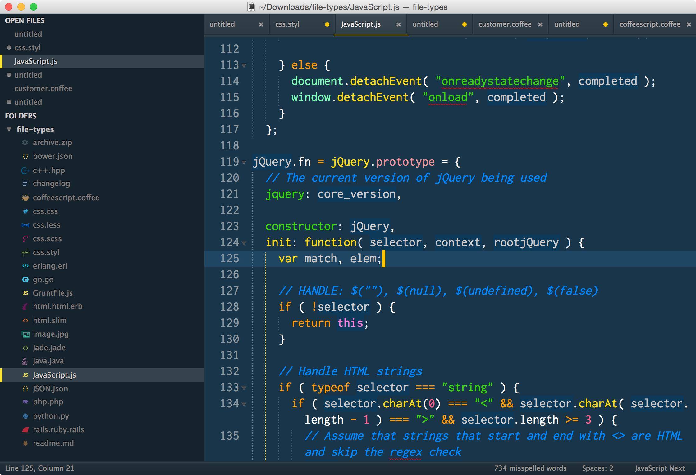

# .dotfiles
A compilation of all dot files used in my environment.

## Websites with great customization ideas and tips
* The Text Triumvirate - http://www.drbunsen.org/the-text-triumvirate/
* How to customize prompt - http://code.tutsplus.com/tutorials/how-to-customize-your-command-prompt--net-24083
* Installing powerline and integrating with iterm2 - https://coderwall.com/p/yiot4q/setup-vim-powerline-and-iterm2-on-mac-os-x
* Installing powerline plugins for vim, tmux, and shell - http://askubuntu.com/questions/283908/how-can-i-install-and-use-powerline-plugin
* Setting up powerline (more complete) - http://blog.codefront.net/2013/10/27/installing-powerline-on-os-x-homebrew/
* Tmux resurrect - https://github.com/tmux-plugins/tmux-resurrect
* Cobalt2 Sublime Text theme - https://github.com/wesbos/cobalt2
* Reattach-to-user-namespace - actually copy and paste in tmux https://robots.thoughtbot.com/tmux-copy-paste-on-os-x-a-better-future

## Inspiration

## Notes:
###Required

* psutil: `pip install psutil`
* powerline-status: `pip install powerline-status`

###Font:

* Droid Sans Mono - 14pt

###To do:
Write script to automate most of environment setup with dotfiles.

